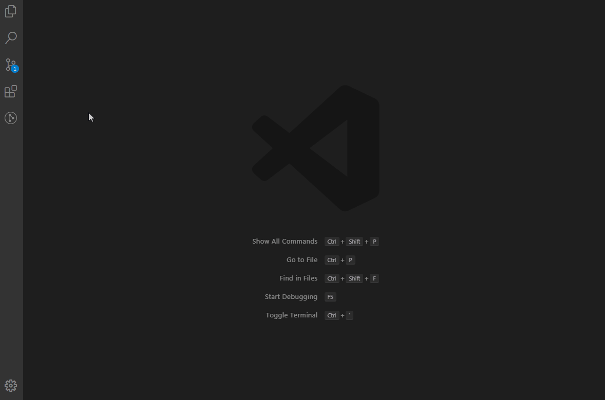
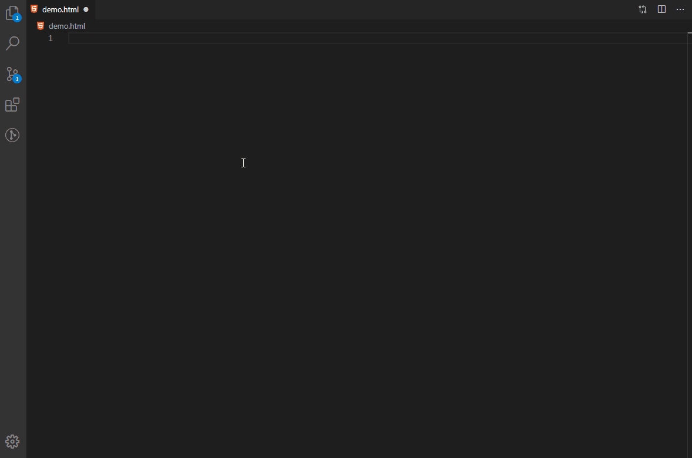

# Po-Snippets for VS Code

Snippets para auxílio no desenvolvimento de telas utilizando a biblioteca [Portinari](https://portinari.io/)

## Instalação

Para instalar os snippets:
- Acesse a opção Extensions (Ctrl + Shit + x) no Visual Studio Code
- Pesquise por po snippets
- Instale a extensão

## Utilização

Para utilizar o pacote de snipets basta digitar `<po` que uma lista de comandos disponíveis será apresentada:

## Po Snippets

| Snippet                           | Componente                                                                                    |
| --------------------------------- | --------------------------------------------------------------------------------------------- |
| `<po-accordion>`                  | [Accordion](https://portinari.io/documentation/po-accordion)                                  |
| `<po-avatar>`                     | [Avatar](https://portinari.io/documentation/po-avatar)                                        |
| `<po-breadcrumb>`                 | [Breadcrumb](https://portinari.io/documentation/po-breadcrumb)                                |
| `<po-button>`                     | [Button](https://portinari.io/documentation/po-button)                                        |
| `<po-button-group>`               | [Button Group](https://portinari.io/documentation/po-button-group)                            |
| `<po-calendar>`                   | [Calendar](https://portinari.io/documentation/po-calendar)                                    |
| `<po-chart>`                      | [Chart](https://portinari.io/documentation/po-chart)                                          |
| `<po-checkbox>`                   | [Checkbox](https://portinari.io/documentation/po-checkbox)                                    |
| `<po-checkbox-group>`             | [Checkbox Group](https://portinari.io/documentation/po-checkbox-group)                        |
| `<po-code-editor>`                | [Code Editor](https://portinari.io/documentation/po-code-editor)                              |
| `<po-combo>`                      | [Combo](https://portinari.io/documentation/po-combo)                                          |
| `<po-container>`                  | [Container](https://portinari.io/documentation/po-container)                                  |
| `<po-datepicker>`                 | [Datepicker](https://portinari.io/documentation/po-datepicker)                                |
| `<po-datepicker-range>`           | [Datepicker Range](https://portinari.io/documentation/po-datepicker-range)                    |
| `<po-decimal>`                    | [Decimal](https://portinari.io/documentation/po-decimal)                                      |
| `<po-disclaimer-group>`           | [Disclaimer Group](https://portinari.io/documentation/po-disclaimer-group)                    |
| `<po-divider>`                    | [Divider](https://portinari.io/documentation/po-divider)                                      |
| `<po-dropdown>`                   | [Dropdown](https://portinari.io/documentation/po-dropdown)                                    |
| `<po-dynamic-form>`               | [Dynamic Form](https://portinari.io/documentation/po-dynamic-form)                            |
| `<po-dynamic-view>`               | [Dynamic View](https://portinari.io/documentation/po-dynamic-view)                            |
| `<po-email>`                      | [Email](https://portinari.io/documentation/po-email)                                          |
| `<po-grid>`                       | [Grid](https://portinari.io/documentation/po-grid)                                            |
| `<po-info>`                       | [Info](https://portinari.io/documentation/po-info)                                            |
| `<po-input>`                      | [Input](https://portinari.io/documentation/po-input)                                          |
| `<po-list-view>`                  | [List View](https://portinari.io/documentation/po-list-view)                                  |
| `<po-loading-overlay>`            | [Loading Overlay](https://portinari.io/documentation/po-loading-overlay)                      |
| `<po-login>`                      | [Login](https://portinari.io/documentation/po-login)                                          |
| `<po-lookup>`                     | [Lookup](https://portinari.io/documentation/po-lookup)                                        |
| `<po-menu>`                       | [Menu](https://portinari.io/documentation/po-menu)                                            |
| `<po-modal>`                      | [Modal](https://portinari.io/documentation/po-modal)                                          |
| `<po-modal-password-recovery>`    | [Modal Password Recovery](https://portinari.io/documentation/po-modal-password-recovery)      |
| `<po-multiselect>`                | [Multiselect](https://portinari.io/documentation/po-multiselect)                              |
| `<po-navbar>`                     | [Navbar](https://portinari.io/documentation/po-navbar)                                        |
| `<po-number>`                     | [Number](https://portinari.io/documentation/po-number)                                        |
| `<po-page-default>`               | [Page Default](https://portinari.io/documentation/po-page-default)                            |
| `<po-page-detail>`                | [Page Detail](https://portinari.io/documentation/po-page-detail)                              |
| `<po-page-edit>`                  | [Page Edit](https://portinari.io/documentation/po-page-edit)                                  |
| `<po-page-list>`                  | [Page List](https://portinari.io/documentation/po-page-list)                                  |
| `<po-page-login>`                 | [Page Login](https://portinari.io/documentation/po-page-login)                                |
| `<po-password>`                   | [Password](https://portinari.io/documentation/po-password)                                    |
| `<po-popover>`                    | [Popover](https://portinari.io/documentation/po-popover)                                      |
| `<po-popup>`                      | [Popup](https://portinari.io/documentation/po-popup)                                          |
| `<po-radio-group>`                | [Radio Group](https://portinari.io/documentation/po-radio-group)                              |
| `<po-select>`                     | [Select](https://portinari.io/documentation/po-select)                                        |
| `<po-stepper>`                    | [Stepper](https://portinari.io/documentation/po-stepper)                                      |
| `<po-switch>`                     | [Switch](https://portinari.io/documentation/po-switch)                                        |
| `<po-tab>`                        | [Tab](https://portinari.io/documentation/po-tab)                                              |
| `<po-table>`                      | [Table](https://portinari.io/documentation/po-table)                                          |
| `<po-tabs>`                       | [Tabs](https://portinari.io/documentation/po-tabs)                                            |
| `<po-textarea>`                   | [Textarea](https://portinari.io/documentation/po-textarea)                                    |
| `<po-toolbar>`                    | [Toolbar](https://portinari.io/documentation/po-toolbar)                                      |
| `<po-upload>`                     | [Upload](https://portinari.io/documentation/po-upload)                                        |
| `<po-widget>`                     | [Widget](https://portinari.io/documentation/po-widget)                                        |
| `<po-tag>`                        | [Tag](https://portinari.io/documentation/po-tag)                                              |

# Contribuição

- Os snippets estão localizados no arquivo snippets/snippets.json
- Para contribuir ou corrigir algo é só editar esse arquivo e fazer um PR, aprovaremos ele e subiremos uma nova versão na loja do Visual Code :)